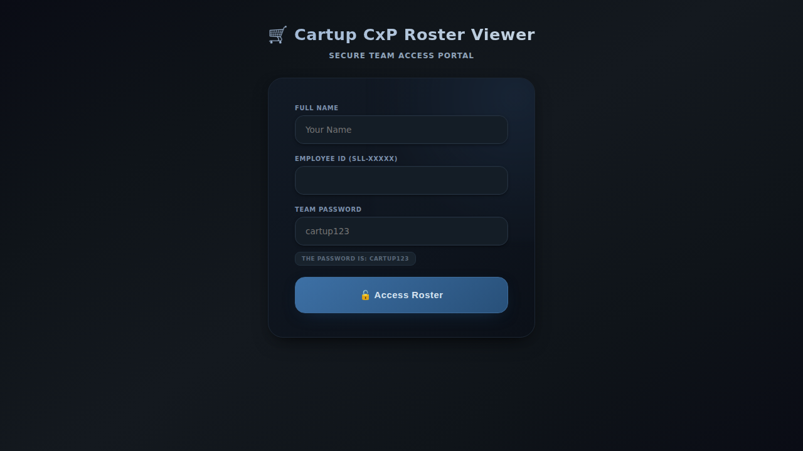

# How to Convert Documentation to PDF/DOC/DOCX

This guide explains how to convert the Markdown documentation files into PDF, DOC, or DOCX formats for presentations and sharing.

## 📋 Available Documentation Files

1. **PRODUCT_SHOWCASE_DOCUMENTATION.md** - Main comprehensive product documentation (21KB, ~300 pages when converted)
2. **SCREENSHOT_INDEX.md** - Index of all screenshots with descriptions
3. **README.md** - Project overview
4. **TESTING_GUIDE.md** - Comprehensive testing procedures
5. **QUICK_START.md** - Quick start guide
6. **IMPLEMENTATION_SUMMARY.md** - Technical implementation details

## 🛠️ Conversion Methods

### Method 1: Using Pandoc (Recommended)

Pandoc is a powerful universal document converter that handles Markdown excellently.

#### Installation

**Mac:**
```bash
brew install pandoc
brew install basictex  # For PDF generation
```

**Windows:**
- Download from: https://pandoc.org/installing.html
- Install MiKTeX for PDF: https://miktex.org/download

**Linux (Ubuntu/Debian):**
```bash
sudo apt-get install pandoc
sudo apt-get install texlive-xetex  # For PDF generation
```

#### Convert to PDF

```bash
# Basic PDF conversion
pandoc PRODUCT_SHOWCASE_DOCUMENTATION.md -o Product_Showcase.pdf

# PDF with better formatting
pandoc PRODUCT_SHOWCASE_DOCUMENTATION.md -o Product_Showcase.pdf \
  --pdf-engine=xelatex \
  --toc \
  --toc-depth=2 \
  -V geometry:margin=1in \
  -V fontsize=11pt

# PDF with custom styling
pandoc PRODUCT_SHOWCASE_DOCUMENTATION.md -o Product_Showcase.pdf \
  --pdf-engine=xelatex \
  --toc \
  -V colorlinks=true \
  -V linkcolor=blue \
  -V urlcolor=blue \
  -V geometry:margin=1in
```

#### Convert to DOCX (Microsoft Word)

```bash
# Basic DOCX conversion
pandoc PRODUCT_SHOWCASE_DOCUMENTATION.md -o Product_Showcase.docx

# DOCX with table of contents
pandoc PRODUCT_SHOWCASE_DOCUMENTATION.md -o Product_Showcase.docx --toc

# DOCX with reference document for styling
pandoc PRODUCT_SHOWCASE_DOCUMENTATION.md -o Product_Showcase.docx \
  --reference-doc=custom-reference.docx
```

#### Convert to ODT (OpenOffice/LibreOffice)

```bash
pandoc PRODUCT_SHOWCASE_DOCUMENTATION.md -o Product_Showcase.odt --toc
```

#### Batch Convert All Documentation

```bash
# Create a folder for outputs
mkdir -p converted-docs

# Convert all MD files to PDF
for file in *.md; do
  pandoc "$file" -o "converted-docs/${file%.md}.pdf" \
    --pdf-engine=xelatex \
    --toc
done

# Convert all MD files to DOCX
for file in *.md; do
  pandoc "$file" -o "converted-docs/${file%.md}.docx" --toc
done
```

### Method 2: Using Online Converters

#### 1. Dillinger (Free, No Installation)
- Visit: https://dillinger.io/
- Paste the Markdown content
- Click "Export as" → Choose PDF or Styled HTML
- For DOCX: Export HTML, then open in Word and save as DOCX

#### 2. StackEdit (Free, No Installation)
- Visit: https://stackedit.io/
- Import the Markdown file
- Click menu → Export to Disk → Choose format

#### 3. CloudConvert (Free tier available)
- Visit: https://cloudconvert.com/md-to-pdf
- Upload the .md file
- Convert to PDF, DOCX, or other formats

### Method 3: Using Microsoft Word

1. **Direct Import:**
   - Open Microsoft Word
   - File → Open → Select the .md file
   - Word will convert Markdown to formatted document
   - Save as .docx or export as PDF

2. **Via HTML:**
   - Use Pandoc to convert to HTML:
     ```bash
     pandoc PRODUCT_SHOWCASE_DOCUMENTATION.md -o temp.html
     ```
   - Open temp.html in Word
   - Save as DOCX or PDF

### Method 4: Using Google Docs

1. **Via Import:**
   - Go to Google Docs
   - File → Open → Upload → Select the .md file
   - Google Docs will attempt to convert it
   - Download as PDF or DOCX

2. **Via Docs Add-on:**
   - Install "Docs to Markdown" or similar add-on
   - Can work in reverse for better formatting

### Method 5: Using Visual Studio Code

If you have VS Code with Markdown extensions:

1. **Install Extensions:**
   - "Markdown PDF" by yzane
   - "Markdown All in One" by Yu Zhang

2. **Convert:**
   - Open the .md file in VS Code
   - Right-click → "Markdown PDF: Export (pdf)"
   - Choose output format (PDF, HTML, PNG)

### Method 6: Using Python (for automation)

```python
# Install: pip install markdown2 pdfkit
import markdown2
import pdfkit

# Read Markdown
with open('PRODUCT_SHOWCASE_DOCUMENTATION.md', 'r') as f:
    md_content = f.read()

# Convert to HTML
html = markdown2.markdown(md_content)

# Add styling
styled_html = f"""
<html>
<head>
    <style>
        body {{ font-family: Arial, sans-serif; margin: 40px; }}
        h1 {{ color: #2c3e50; border-bottom: 2px solid #3498db; }}
        h2 {{ color: #34495e; }}
        code {{ background: #ecf0f1; padding: 2px 6px; }}
    </style>
</head>
<body>{html}</body>
</html>
"""

# Convert to PDF
pdfkit.from_string(styled_html, 'Product_Showcase.pdf')
```

## 🎨 Enhancing the Output

### Adding Images to Converted Documents

The Markdown files reference screenshots using relative paths:
```markdown

```

**For Pandoc conversions:**
- Images will be automatically embedded if paths are correct
- Ensure you run pandoc from the repository root directory

**For manual conversions:**
- Copy the `product-showcase-screenshots/` folder alongside the document
- Images should automatically appear in the converted document

### Custom Styling for PDF

Create a `custom.yaml` file:

```yaml
---
title: "Cartup CxP Roster Management System"
subtitle: "Complete Product Documentation"
author: "Cartup CxP Team"
date: "October 2025"
toc: true
toc-depth: 3
linkcolor: blue
urlcolor: blue
geometry: margin=1in
fontsize: 11pt
---
```

Then convert with:
```bash
pandoc PRODUCT_SHOWCASE_DOCUMENTATION.md custom.yaml \
  -o Product_Showcase.pdf \
  --pdf-engine=xelatex
```

### Custom Styling for DOCX

1. Create a reference document:
   ```bash
   pandoc --print-default-data-file reference.docx > custom-reference.docx
   ```

2. Open `custom-reference.docx` in Word and customize:
   - Heading styles
   - Font family and sizes
   - Colors
   - Margins

3. Use it as reference:
   ```bash
   pandoc PRODUCT_SHOWCASE_DOCUMENTATION.md \
     -o Product_Showcase.docx \
     --reference-doc=custom-reference.docx
   ```

## 📦 Recommended Output Formats

### For Client Presentations
**Format**: PDF  
**Why**: Maintains formatting, universally readable, professional

```bash
pandoc PRODUCT_SHOWCASE_DOCUMENTATION.md -o Product_Showcase_Client.pdf \
  --pdf-engine=xelatex \
  --toc \
  -V colorlinks=true \
  -V linkcolor=blue \
  -V geometry:margin=1in
```

### For Internal Editing
**Format**: DOCX  
**Why**: Editable, collaborative, familiar to most users

```bash
pandoc PRODUCT_SHOWCASE_DOCUMENTATION.md -o Product_Showcase_Internal.docx --toc
```

### For Web Sharing
**Format**: HTML  
**Why**: Interactive, accessible, no download needed

```bash
pandoc PRODUCT_SHOWCASE_DOCUMENTATION.md -o Product_Showcase.html \
  --standalone \
  --toc \
  --css=styles.css
```

### For Presentations
**Format**: PowerPoint (PPTX)  
**Why**: Slide-based, visual, presentation-ready

```bash
# Extract key sections and convert
pandoc PRODUCT_SHOWCASE_DOCUMENTATION.md -o Product_Showcase.pptx \
  --slide-level=2
```

## 🔍 Quality Check After Conversion

After converting, verify:

- [ ] All headings are properly formatted
- [ ] Images are embedded and visible
- [ ] Links are clickable (for PDF/HTML)
- [ ] Table of contents is generated
- [ ] Code blocks are formatted correctly
- [ ] Lists and tables are readable
- [ ] Page breaks are logical
- [ ] File size is reasonable

## 🚀 Quick Start Commands

**Most Common Conversions:**

```bash
# High-quality PDF
pandoc PRODUCT_SHOWCASE_DOCUMENTATION.md -o Product_Showcase.pdf --pdf-engine=xelatex --toc

# Microsoft Word document
pandoc PRODUCT_SHOWCASE_DOCUMENTATION.md -o Product_Showcase.docx --toc

# HTML for web
pandoc PRODUCT_SHOWCASE_DOCUMENTATION.md -o Product_Showcase.html --standalone --toc

# All three at once
pandoc PRODUCT_SHOWCASE_DOCUMENTATION.md -o Product_Showcase.pdf --pdf-engine=xelatex --toc && \
pandoc PRODUCT_SHOWCASE_DOCUMENTATION.md -o Product_Showcase.docx --toc && \
pandoc PRODUCT_SHOWCASE_DOCUMENTATION.md -o Product_Showcase.html --standalone --toc
```

## 📞 Troubleshooting

### Issue: "pandoc: command not found"
**Solution**: Install Pandoc using the instructions above for your OS

### Issue: PDF generation fails with "pdflatex not found"
**Solution**: Install a LaTeX distribution (MiKTeX, TeX Live, or BasicTeX)

### Issue: Images not showing in PDF
**Solution**: 
- Ensure you're running pandoc from the repository root
- Check that image paths are correct
- Try using absolute paths temporarily for testing

### Issue: DOCX formatting looks wrong
**Solution**: Use a custom reference document with desired styles

### Issue: File size too large
**Solution**: 
- Compress images before conversion
- Use `--dpi=150` flag for PDF
- Remove unnecessary screenshots

## 💡 Pro Tips

1. **Always keep the original Markdown files** - They're your source of truth
2. **Version control converted files separately** - Or use .gitignore
3. **Test conversions early** - Don't wait until you need to present
4. **Create templates** - Save your pandoc commands in scripts
5. **Automate with CI/CD** - Auto-generate PDFs on every commit

## 📚 Additional Resources

- Pandoc Documentation: https://pandoc.org/MANUAL.html
- Markdown Guide: https://www.markdownguide.org/
- LaTeX Installation: https://www.latex-project.org/get/
- Markdown to PDF Best Practices: https://learnbyexample.github.io/customizing-pandoc/

---

**Need Help?**
- Check the Pandoc manual: `pandoc --help`
- Visit Pandoc community: https://github.com/jgm/pandoc/discussions
- Review example commands above

---

*Last Updated*: October 11, 2025  
*Supports*: Pandoc 2.x+, Word 2016+, LibreOffice 6+
